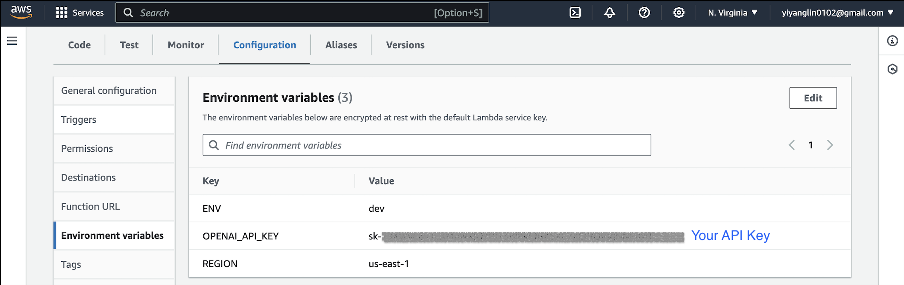
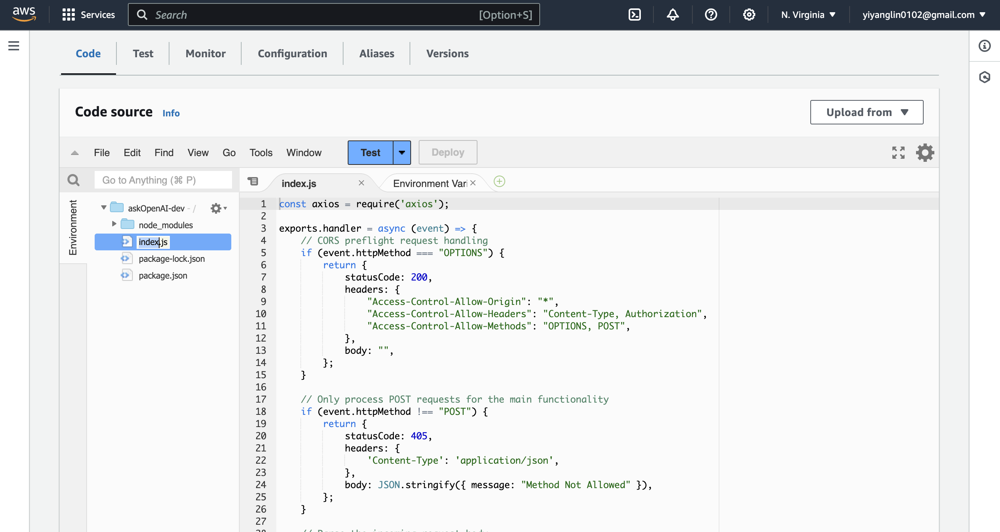

# OpenAI Chat Application

A simple web-based chat interface that communicates with OpenAI's GPT-4 model. Experience conversational AI firsthand at [chat.yiyanglin.com](http://chat.yiyanglin.com).

## Features

- Developed and deployed a responsive web chat application that interacts with OpenAI's GPT-4 model to generate real-time conversational responses.
- Utilized AWS Amplify to streamline the deployment of the frontend and backend, ensuring a cohesive serverless architecture.
- Leveraged AWS Lambda for executing backend logic in response to API requests, providing scalability and on-demand compute power.
- Configured AWS API Gateway to create RESTful endpoints that serve as the entry point for the application, managing traffic and authorizations efficiently.
- Integrated the OpenAI API using Axios for HTTP requests, with comprehensive error handling mechanisms to manage potential API concerns.
- Enhanced user experience with immediate message submission capability via the 'Enter' key and optimized API call responses to maintain engagement.
- Implemented a mobile-responsive, retro-themed frontend using vanilla JavaScript, CSS, and Google Fonts' 'Press Start 2P' for visual appeal.
- Set up subdomain redirection using AWS Route 53, seamlessly directing [`chat.yiyanglin.com`](https://aws.amazon.com/amplify/) to the application and enhancing the user journey.

## Prerequisites

- AWS Account with AWS Amplify, Lambda, and API Gateway configured.
- [Node.js](https://nodejs.org/)
- An OpenAI API key.

## Setup & Installation

1. **Clone the Repository**

   ```bash
   git clone https://github.com/yiyanglin0102/ChatAI.git
   cd ChatAI
   ```

2. **Environment**

   - **Connect your GitHub repository to [AWS Amplify](https://aws.amazon.com/amplify/).**

   - **Set your environment variables on the  [AWS Lambda](https://aws.amazon.com/lambda/).**

   - **Create a `environment variable` in the root directory and add your OpenAI API key:**

   ```bash
   OPENAI_API_KEY=YOUR_API_KEY_HERE
   ```

   

   - **Upload backend lambda function.**

    

3. **Run Locally**

   Start the development server:

   Visit `http://localhost:NUMBER` to view the front end chat application.

## Deployment
 - To redirect the subdomain chat.yiyanglin.com to the Amplify app, a CNAME record in AWS Route 53 DNS settings was created, pointing to the Amplify-generated domain.
## Tech Stack

   - Frontend: Vanilla HTML, CSS, and JavaScript. Hosted on AWS Amplify Console.
   - Backend: AWS Lambda for serverless API requests, with API Gateway as the HTTP endpoint interface.

## Contributing
   Pull requests are welcome. For major changes, please open an issue first to discuss what you would like to change.

## License

   [MIT](https://choosealicense.com/licenses/mit/)

   Feel free to modify any parts to better suit your needs or the specifics of your project!
